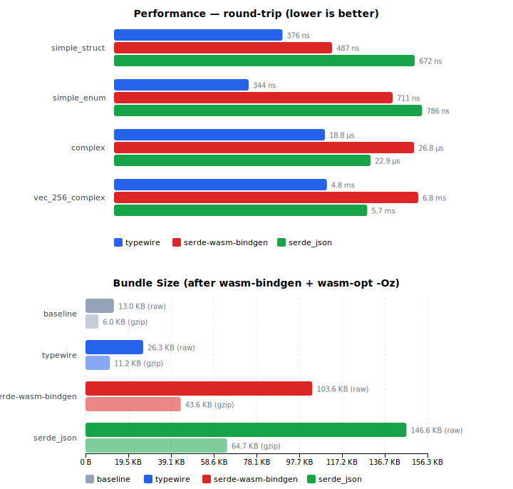

# Benchmarks

Performance and bundle size comparisons between typewire, serde-wasm-bindgen, and serde_json.



## Running

```sh
cargo xtask bench          # run all benchmarks (size + perf)
cargo xtask bench size     # bundle size comparison only
cargo xtask bench perf    # performance benchmarks only
cargo xtask bench --json   # machine-readable JSON output (for CI)
```

### Generating the chart

`cargo xtask bench` (without `--json`) automatically regenerates `benches/wasm.svg` after
running all suites. It installs chart dependencies (`d3`, `jsdom`) via npm if needed.

To regenerate the chart manually from existing JSON:

```sh
cargo xtask bench --json | node benches/wasm/chart.js > benches/wasm.svg
```

## Performance benchmarks

The `bench-wasm` crate measures round-trip serialization timing for three libraries:

- **typewire** -- direct `to_js`/`from_js` with JS objects
- **serde-wasm-bindgen** -- serde via `JsValue`
- **serde_json** -- serde via JSON strings

Values cross the wasm–JS boundary via identity functions to ensure fair measurement.

### Types benchmarked

- **Simple struct** -- 4 primitive fields (u32, String, f64, bool)
- **Simple enum** -- externally tagged union with Create/Update/Delete variants
- **Complex struct** -- nested struct, Vec, Option, HashMap
- **Complex collection** -- Vec of Complex structs

### How it works

Each benchmark function runs N iterations inside wasm, measuring elapsed time with
`performance.now()`. The JS runner calls each benchmark function and prints a comparison table.
This avoids the overhead of crossing the wasm boundary per iteration.

## Bundle size analysis

The unified `bench-wasm` crate with size feature flags, built separately for each strategy:

| Feature | Strategy |
|---------|----------|
| `baseline` | wasm-bindgen only, pass-through (no conversion) |
| `serde-wasm-bindgen` | serde + serde-wasm-bindgen |
| `typewire` | typewire derive |
| `serde-json` | serde + serde_json |

The command builds the crate once per feature for `wasm32-unknown-unknown --release`, runs
wasm-bindgen to strip metadata, then `wasm-opt -Oz` on each output. Raw and gzip'd sizes are
reported with deltas from the baseline.

### Types used

All strategies define the same types:

- `User` -- struct with 5 fields (u32, String, String, bool, f64), camelCase renaming
- `Address` -- struct with 3 String fields
- `Profile` -- nested struct with User, Address, Vec, Option
- `Command` -- externally tagged enum (Create/Update/Delete)
- `Event` -- adjacently tagged enum (Created/Updated/Deleted)

## CI regression detection

The CI `Bench` job runs `cargo xtask bench --json` on every push. On `main`, results are stored
in git notes (`refs/notes/bench`). Size metrics that regress by more than 1.5% compared to the
parent cause the bench job to fail. Perf metrics are reported for informational purposes only
(timing on shared CI runners is too noisy for hard thresholds).
